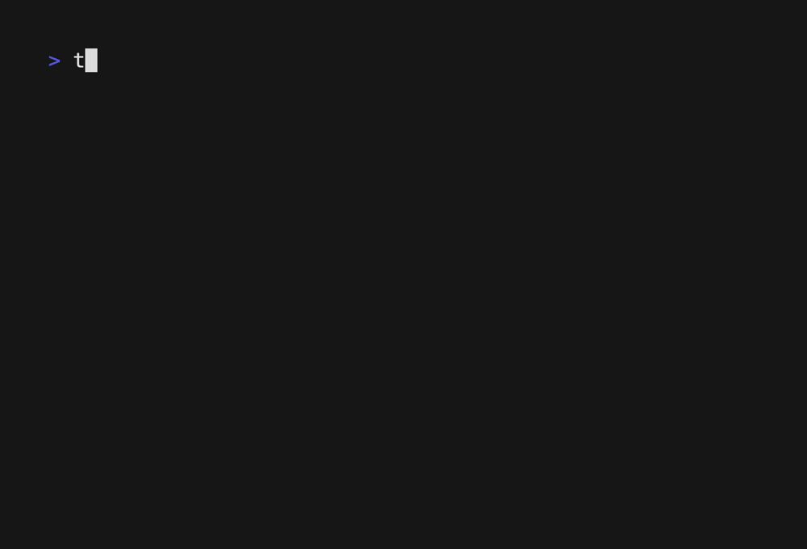

# tfdiff
Generate reports for your migration from ClickOps to Terraform.



## Features
- [x] Output list of unmanaged resources to CSV
- [x] CLI reporting with asset breakdown by region and resource type
- [x] Multi-region scan support

## Installation

This program may be installed by downloading the latest executable from the releases page, moving it into your path, and making it executable. See the example below for Unix-based environments:
```sh
wget https://github.com/cosmotek/tfdiff/releases/download/1.0.0-rc1/tfdiff-linux-amd64
mv tfdiff-linux-amd64 /usr/local/bin/tfdiff
chmod +x /usr/local/bin/tfdiff
```

## Usage

Before running tfdiff, you will need to have the following:
- An AWS account with Resource Explorer 2 enabled
- A valid AWS credentials file with a profile for the account you want to diff
- Terraform installed on your machine

Once you have all the requirements, you may run tfdiff like so:
```sh
# open your terraform project
cd my-terraform-project

# select the terraform workspace you want to diff (assuming you have one)
terraform workspace select development

# select an AWS profile with credentials for the target environment
export AWS_PROFILE=development

# run tfdiff against two regions, outputing the list of unmanaged resources to a csv file
tfdiff aws --regions=us-east-1,us-east-2 --output-file unmanaged_resources.csv
```

For more configuration options, run `tfdiff aws --help`.

## Known issues & limitations

- AWS Inventory Truncation:
This tool uses the AWS Resource Explorer 2 API to list asset inventory in the target environment. This API has a max page size of 1000, with no pagination support. Tfdiff scans each region and each resource type individually in order to hitting this limit wherever possible, but it's possible that regions/resource types with a lot of assets may be truncated at 1000. We are currently exploring other workarounds, for now tfdiff just outputs a warning for any region/resource type combo that returns exactly 1000 resources.
- AWS Service Quotas:
Given tfdiff makes `num_target_regions * num_resource_types` queries for each diff, the AWS services quotas may be exceeded with many monthly executions. Hitting a quota will cause this tool to error out completely. You may request a quota adjustment by AWS in the Services Quota Console.

## Planned features

- [ ] Resource Type Filters
- [ ] The ability to ignore resources by ARN/Identifier via .tfdiff_ignore files
- [ ] Support for GCP, Azure & DigitalOcean
- [ ] (Possible) Scan Caching